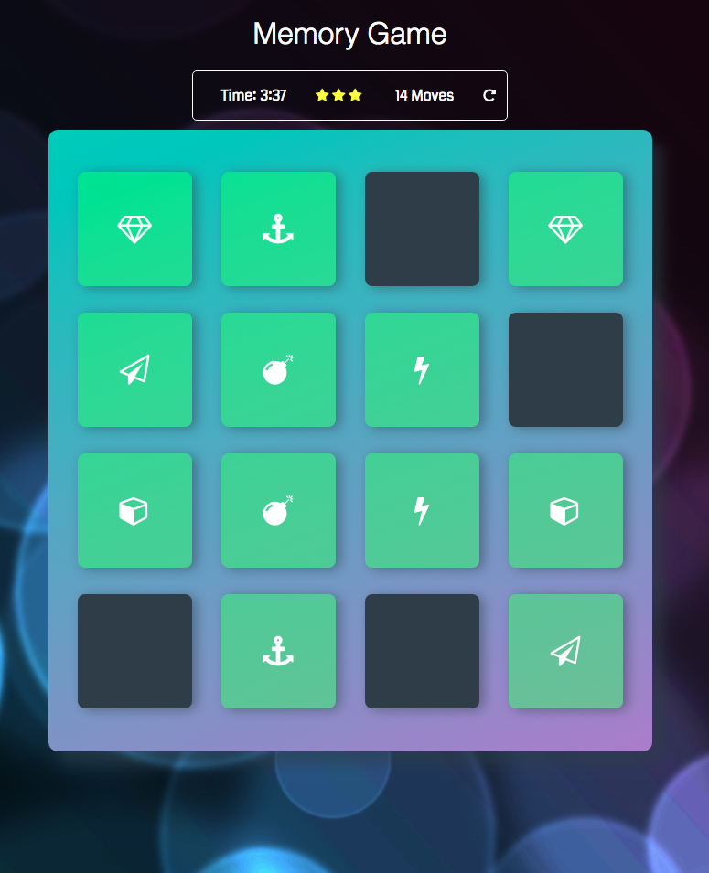

# Memory Game

A course project to create a memory game for the Udacity nano-degree




## Getting Started

The game loads instantly to play, once you click your first reveal a timer will start, you have a number of moves within a given time frame to match symbols

### Prerequisites


```
None
```

## Deployment

Add additional notes about how to deploy this on a live system

## Built With

* HTML
* CSS
* Vanilla Javascript


## Authors

* **Kevin Rollins- *Initial work* - [KR71](https://github.com/KR71)


## License

This project is licensed under the MIT License - see the [LICENSE.md](LICENSE.md) file for details

## Acknowledgments

* Udacity Tutors
* Stack Overflow
git
